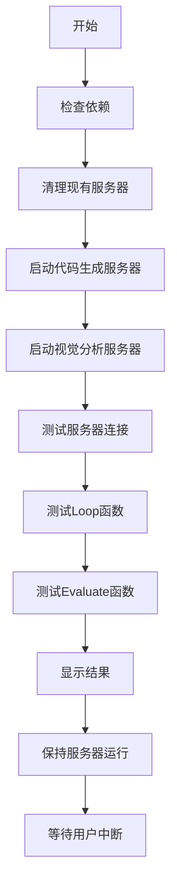

# Multi-Agent Graph测试脚本使用说明

## 概述

`test_multi_agent_graph.sh` 是一个完整的测试脚本，用于启动sglang服务器并测试`FrontendDesignAgentGraph`的`loop`和`evaluate`函数。

## 快速开始

### 1. 赋予执行权限
```bash
chmod +x test_multi_agent_graph.sh
```

### 2. 基础运行（使用默认设置）
```bash
./test_multi_agent_graph.sh
```

### 3. 使用自定义模型
```bash
./test_multi_agent_graph.sh --model-path "microsoft/DialoGPT-large"
```

### 4. 自定义端口
```bash
./test_multi_agent_graph.sh --code-port 8002 --visual-port 8003
```

### 5. 查看帮助
```bash
./test_multi_agent_graph.sh --help
```

## 命令行选项

| 选项 | 默认值 | 说明 |
|------|--------|------|
| `--model-path PATH` | `microsoft/DialoGPT-medium` | sglang服务器使用的模型路径 |
| `--code-port PORT` | `8000` | 代码生成服务器端口 |
| `--visual-port PORT` | `8001` | 视觉分析服务器端口 |
| `--num-samples N` | `1` | 测试样本数量 |
| `--cleanup-only` | - | 仅清理现有服务器并退出 |
| `--help` | - | 显示帮助信息 |

## 脚本功能

### 🚀 自动启动服务器
- 启动两个sglang服务器实例
- 自动检测端口冲突并清理
- 等待服务器准备就绪
- 详细的日志记录

### 🧪 测试功能
1. **服务器连接测试**: 验证两个服务器都能正常响应
2. **Loop函数测试**: 测试简化的单步交互函数
3. **Evaluate函数测试**: 测试完整的评估流程

### 📊 输出信息
- 彩色输出便于识别状态
- 详细的测试结果
- 自动生成测试结果JSON文件
- 服务器日志保存在`./logs/`目录

## 执行流程



## 输出示例

```bash
[INFO] Starting Multi-Agent Graph Testing Script
[INFO] ==========================================
[INFO] Configuration:
[INFO]   Model Path: microsoft/DialoGPT-medium
[INFO]   Code Port: 8000
[INFO]   Visual Port: 8001
[INFO]   Hostname: localhost
[INFO]   Number of samples: 1
[INFO]   Log Directory: ./logs

[INFO] Starting sglang servers...
[INFO] Starting sglang server for code on port 8000...
[SUCCESS] sglang server for code is ready!
[INFO] Starting sglang server for visual on port 8001...
[SUCCESS] sglang server for visual is ready!

[INFO] Testing server connectivity...
[SUCCESS] Code generation server is responding
[SUCCESS] Visual analysis server is responding
[SUCCESS] Both servers are responding correctly!

[INFO] Running tests...
[INFO] Testing loop function...
🔄 Testing loop function...
🔍 Detected 2 agents: ['agent1', 'agent2']
📞 Calling loop function...
✅ Loop function completed successfully!
[SUCCESS] Loop function test passed!

[INFO] Testing evaluate function with 1 sample...
🧪 Testing evaluate function...
🚀 Running evaluation...
✅ Evaluation completed successfully!
[SUCCESS] Evaluate function test passed!

[SUCCESS] All tests completed successfully! 🎉
```

## 文件结构

```
.
├── test_multi_agent_graph.sh          # 主测试脚本
├── logs/                               # 服务器日志目录
│   ├── sglang_code_8000.log          # 代码生成服务器日志
│   ├── sglang_visual_8001.log        # 视觉分析服务器日志
│   ├── sglang_code_8000.pid          # 代码服务器PID文件
│   └── sglang_visual_8001.pid        # 视觉服务器PID文件
├── test_results.json                   # 测试结果文件
└── README_test_script.md              # 本说明文件
```

## 故障排除

### 1. 端口被占用
```bash
# 清理所有现有服务器
./test_multi_agent_graph.sh --cleanup-only

# 或手动清理特定端口
sudo lsof -ti:8000 | xargs kill -9
sudo lsof -ti:8001 | xargs kill -9
```

### 2. 模型下载问题
```bash
# 使用本地模型路径
./test_multi_agent_graph.sh --model-path "/path/to/your/model"

# 或使用更小的模型
./test_multi_agent_graph.sh --model-path "microsoft/DialoGPT-small"
```

### 3. 依赖检查
脚本会自动检查以下依赖：
- `python`: Python解释器
- `curl`: HTTP客户端
- `lsof`: 端口查看工具

### 4. 查看详细日志
```bash
# 查看服务器日志
tail -f logs/sglang_code_8000.log
tail -f logs/sglang_visual_8001.log

# 查看测试结果
cat test_results.json | jq .
```

## 注意事项

1. **资源需求**: 每个sglang服务器需要一定的GPU/CPU资源
2. **网络访问**: 首次运行可能需要下载模型
3. **权限**: 脚本需要能够绑定端口和启动进程的权限
4. **清理**: 脚本会在退出时自动清理服务器进程

## 环境变量

可以通过环境变量设置默认模型：
```bash
export MODEL_PATH="your-preferred-model"
./test_multi_agent_graph.sh
```

## 高级用法

### 并行测试多个配置
```bash
# 在不同终端中运行不同配置
./test_multi_agent_graph.sh --code-port 8000 --visual-port 8001 &
./test_multi_agent_graph.sh --code-port 8002 --visual-port 8003 &
```

### 持续集成
```bash
# 在CI环境中使用（自动退出）
timeout 600 ./test_multi_agent_graph.sh
```

## 支持

如果遇到问题，请检查：
1. 日志文件中的错误信息
2. 服务器是否正常启动
3. 网络连接是否正常
4. 模型路径是否正确 