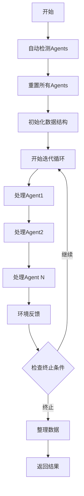

# 通用Multi-Agent系统设计文档

## 概述

这个设计实现了一个通用的multi-agent协作系统，可以自动检测和管理任意数量的智能体，并按照标准化的命名方式（agent1, agent2, agent3等）组织数据结构。

## 主要特性

### 1. 🔍 自动Agent检测
系统可以自动扫描并发现所有以 `_agent` 结尾的属性，这些属性必须实现以下接口：
- `reset()` - 重置agent状态
- `update_from_env()` - 从环境更新agent状态
- `update_from_model()` - 从模型响应更新agent状态

### 2. 📊 标准化命名约定
- **原始名称**: `code_agent`, `visual_agent`, `planning_agent` 等
- **标准化名称**: `agent1`, `agent2`, `agent3` 等
- 保留原始名称用于逻辑判断，使用标准化名称用于数据组织

### 3. 🏗️ 通用数据结构
每个agent的更新数据包含：
```python
{
    "agent1": {
        "original_name": "code_agent",           # 原始agent名称
        "trajectory_steps": [...],               # 轨迹步骤
        "rewards": [...],                        # 奖励列表
        "observations": [...],                   # 观察列表
        "actions": [...],                        # 动作列表
        "prompts": [...],                        # 提示列表
        "responses": [...],                      # 响应列表
        "total_reward": 1.5,                     # 总奖励
        "success": True,                         # 成功标志
        "termination_reason": "TASK_COMPLETED",  # 终止原因
        "execution_time": {                      # 执行时间统计
            "llm_time": 2.5,
            "env_time": 1.2, 
            "total_time": 3.7
        }
    },
    "collaboration_data": {                      # 协作数据
        "iterations": [...],                     # 迭代详情
        "final_state": {...},                    # 最终状态
        "task_completion": True,                 # 任务完成状态
        "agent_count": 5,                        # Agent数量
        "agent_names": ["agent1", "agent2", ...] # Agent名称列表
    }
}
```

## 核心函数

### `multi_agent_loop()`
**功能**: 通用的multi-agent交互循环

**特性**:
- 🔄 自动检测并处理任意数量的agents
- ⏱️ 详细的时间统计（LLM时间、环境时间、总时间）
- 📊 完整的轨迹记录
- 🛡️ 错误处理和恢复机制
- 🔚 多种终止条件支持

**参数**:
- `env`: 环境实例
- `initial_observation`: 初始观察
- `max_steps`: 最大步数
- `application_id`: 应用标识符

**返回**: 包含所有agents更新数据的字典

### `_get_agents_list()`
**功能**: 自动检测系统中的所有agents

**流程**:
1. 扫描所有属性，查找以 `_agent` 结尾的属性
2. 验证agent接口（必须有 `reset`, `update_from_env` 方法）
3. 按字母顺序排序以确保一致性
4. 创建标准化名称（agent1, agent2, 等）

### `_get_agent_client_method()`
**功能**: 根据agent类型获取对应的客户端方法

**逻辑**:
- `code` 类型 → `get_code_response`
- `visual` 类型 → `get_visual_response`
- `planning` 类型 → `get_code_response`
- `testing` 类型 → `get_visual_response`
- 其他类型 → 默认使用 `get_code_response`

## 使用示例

### 基础用法
```python
# 创建multi-agent系统
agent_graph = FrontendDesignAgentGraph(
    hostname="localhost",
    code_port=8000,
    visual_port=8001,
    max_iterations=3
)

# 运行multi-agent循环
model_update_data = await agent_graph.multi_agent_loop(
    env=environment,
    initial_observation=obs,
    max_steps=5,
    application_id="task_001"
)

# 访问特定agent的数据
agent1_data = model_update_data["agent1"]
agent2_data = model_update_data["agent2"]
collaboration_info = model_update_data["collaboration_data"]
```

### 扩展新的Agent类型
```python
class ExtendedAgentGraph(FrontendDesignAgentGraph):
    def __init__(self, *args, **kwargs):
        super().__init__(*args, **kwargs)
        
        # 添加新的agents - 会被自动检测
        self.planning_agent = PlanningAgent()
        self.testing_agent = TestingAgent()
        self.review_agent = ReviewAgent()
    
    def _get_agent_client_method(self, original_agent_name: str):
        """扩展支持新的agent类型"""
        if 'planning' in original_agent_name.lower():
            return self.client.get_code_response
        elif 'testing' in original_agent_name.lower():
            return self.client.get_visual_response
        # ... 其他自定义逻辑
        return super()._get_agent_client_method(original_agent_name)
```

## 数据流程



## 优势

### 🔧 灵活性
- 支持任意数量的agents
- 自动适应不同的agent组合
- 易于添加新的agent类型

### 📊 标准化
- 统一的数据格式
- 一致的命名约定
- 可预测的API接口

### 🚀 性能
- 异步执行支持
- 详细的性能统计
- 并行处理能力

### 🛡️ 可靠性
- 完整的错误处理
- 类型安全检查
- 向后兼容性

## 与原始Engine的对比

| 特性 | 原始Engine | 新Multi-Agent系统 |
|------|------------|-------------------|
| Agent数量 | 固定（单个） | 动态检测（任意数量） |
| 命名方式 | 硬编码 | 标准化（agent1, agent2...） |
| 数据结构 | 单一轨迹 | 多agent协作数据 |
| 扩展性 | 有限 | 高度可扩展 |
| 类型安全 | 基础 | 完整类型检查 |

## 使用场景

### 1. Web设计协作
- Code Generation Agent（代码生成）
- Visual Analysis Agent（视觉分析）
- Testing Agent（测试验证）

### 2. 软件开发流程
- Planning Agent（需求规划）
- Development Agent（开发实现）
- Review Agent（代码审查）
- Testing Agent（质量保证）

### 3. 内容创作
- Research Agent（研究收集）
- Writing Agent（内容创作）
- Editing Agent（编辑润色）
- Publishing Agent（发布管理）

## 注意事项

1. **Agent接口要求**: 所有agent必须实现基本接口方法
2. **命名约定**: Agent属性必须以 `_agent` 结尾
3. **类型映射**: 需要在 `_get_agent_client_method` 中定义agent类型与客户端方法的映射
4. **环境兼容性**: 环境必须支持多agent交互模式

## 未来扩展

- 📊 **可视化支持**: 添加agent协作流程的可视化界面
- 🔄 **并行执行**: 支持agents的并行处理而非顺序执行
- 🧠 **智能调度**: 基于agent能力和任务需求的智能调度
- 📈 **性能优化**: 基于历史数据的性能优化建议 